# L'analitzador de tipus HinNer

Aquesta pàgina descriu la pràctica de GEI-LP (edició 2023-2024 Q2). La vostra feina consisteix en implementar un petit analitzador de tipus anomenat *HinNer*.

En aquesta pràctica utilitzarem un llenguatge tipus Haskell per codificar expressions i tipus. Com:

```Haskell
2 :: N
(+) :: N -> N -> N
\x -> (+) 2 x
```

Aquí estarem defining `2` de tipus `N` i `(+)` de tipus `N -> N -> N` i introduïnt l'expressió `\x -> (+) 2 x`.

L'objectiu és fer un sistema d'inferència de tipus amb un conjunt reduït d'expressions seguint el algorisme de Hindley-Milner.

## Tasca 1: la gramàtica

Definiu una gramàtica que sigui capaç de reconèixer una petita expressió tipus Haskell de l'estil dels exemples que apareixen a continuació:

```haskell
2
x
(+) 2
\x -> (+) 2 x
(\x -> (+) 2 x) 4
```

Noteu que només cal reconèixer nombres naturals, variables, alguns operadors en notació prefixa, parèntesis, l'aplicació i l'abstracció.

Utilitzeu l'[streamlit](https://streamlit.io) com a interfície i procureu gestionar el millor que pugueu els errors.

#### Exemple 1:

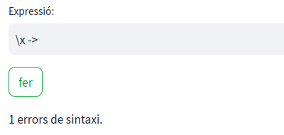

## Tasca 2: el visitador

Els objectius d'aquesta segona tasca són:

- crear un visitador que converteixi l'AST en un arbre semàntic que representi l'expressió

- implementar una funció que mostri l'arbre semàntic en format gràfic 

Utilitzeu els [tipus algebraics](https://gebakx.github.io/Python3/tipusAlgebraics.html) per implementar els arbres semàntics.

Utilitzeu el mètode `graphviz_chart` de l'streamlit per visualitzar l'arbre codificat en llenguatge [DOT](https://graphviz.org/doc/info/lang.html).

#### Exemple 2a:

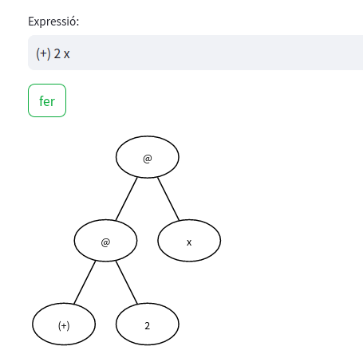

Noteu que `@` representa l'aplicació.

#### Exemple 2b:

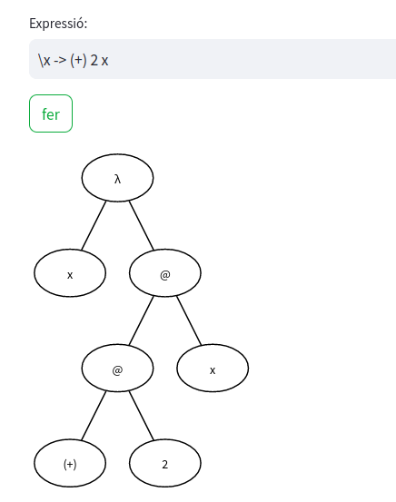

Noteu que la `λ` representa l'abstracció.

## Tasca 3: gestió dels tipus

En aquesta tasca heu d'ampliar el sistema per a que sàpiga reconèixer definicions de tipus i incloure'ls en una taula de símbols. Per això haureu de:

- Ampliar la gramàtica per a que reconegui linies tipus: 
  
  ```Haskell
  2 :: N
  (+) :: N -> N -> N
  ```

- Ampliar el visitador per a que gestioni la taula de símbols

- Ampliar la interfície per a que mostri el contingut de la taula de símbols 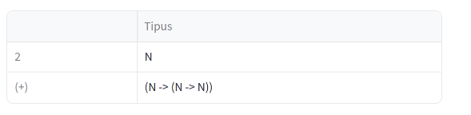

Noteu que a l'exemple surt el tipus concret `N`(en majúscules) i no contemplem la possibilitat d'acceptar variables de tipus.

## Tasca 4: annotació dels AST

En aquesta tasca heu de:

- modificar el tipus algebraic dels arbres semàntics per a que permetin assignar un tipus a cada node de l'arbre.

- fer una funció que annoti a cada node de l'arbre el seu tipus: assignant l'element de la taula de símbols que li pertoqui o una variable nova  

- modificar la funció de visualització dels arbres per a que mostri el tipus de cada node

Vigileu el que passa amb les variables.

#### Exemple 4a:

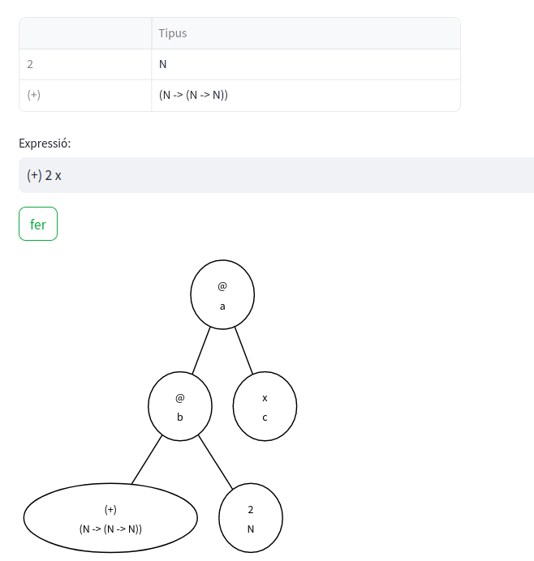

#### Exemple 4b:

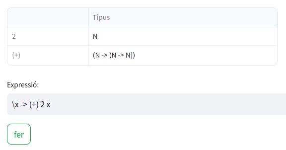

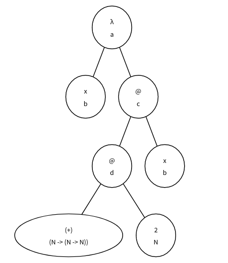

## Tasca 5: inferència de tipus amb l'aplicació

Implementeu una funció per fer la inferència de tipus amb construccions que no continguin abstraccions. Mostreu en una taula el tipus de totes les variables de tipus.

#### Exemple 5a:

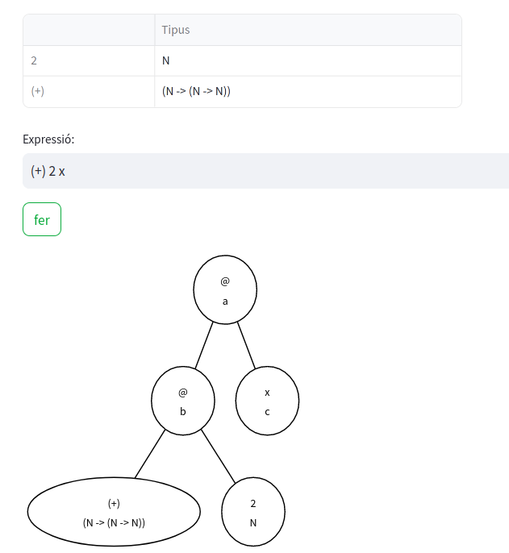

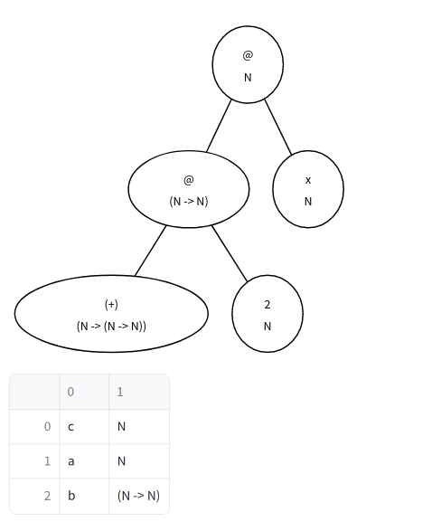

#### Exemple 5b:

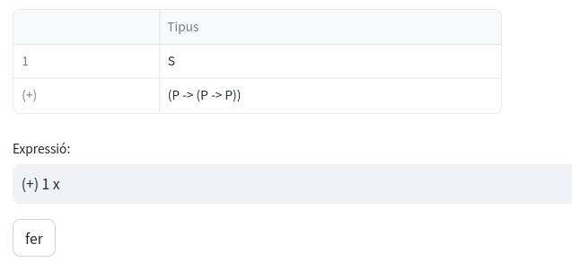

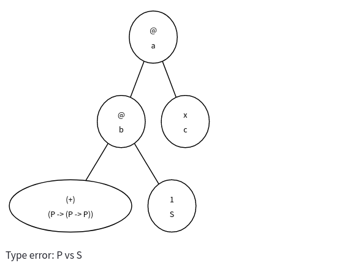

## Tasca 6: inferència de tipus amb l'abstracció

Afegiu el processament de l'abstracció a la funció anterior.

#### Exemple 6:

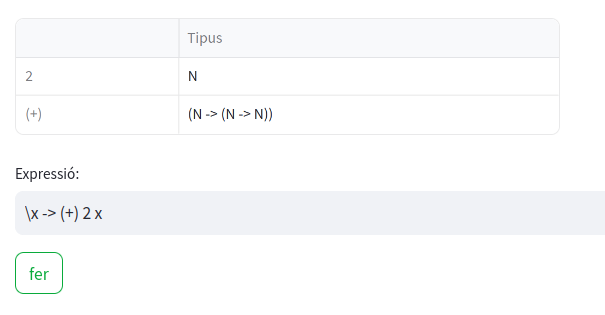

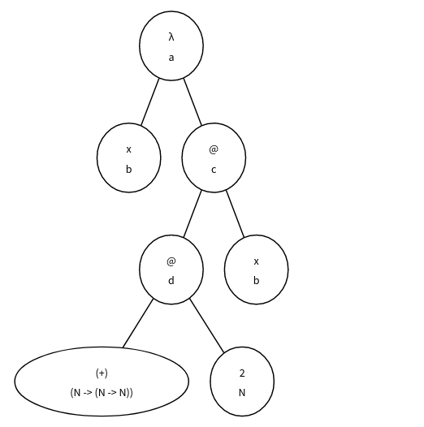

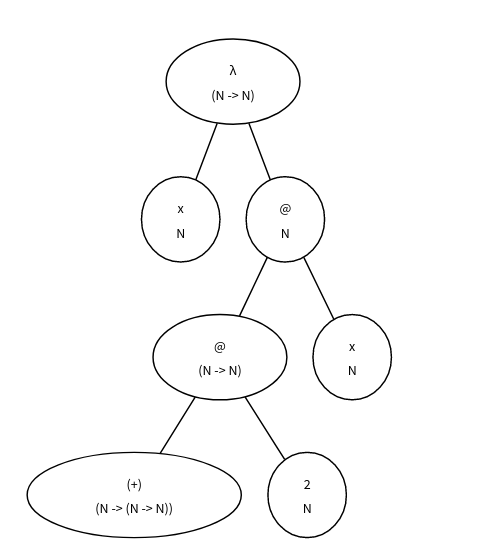

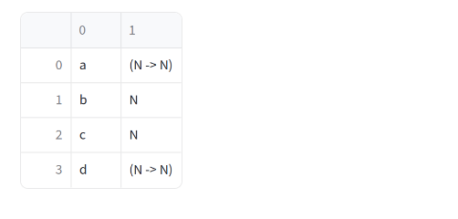

# Consells

Per tal de fer la pràctica, us recomanem de seguir aquests passos:

1. Feu tots els exercicis de laboratori inclosos a [Python 3: compiladors](https://gebakx.github.io/Python3/compiladors.html). Us serà molt útil, de debò.

2. Seguiu l'ordre de les tasques tal i com estan a l'enunciat.

3. En desenvolupar cada tasca, aneu provant que us funcionin els jocs de proves anteriors.

4. Escriviu el README.

5. Si voleu, realitzeu extensions.

Al llarg de tots els passos anteriors, aneu documentant tot allò que no sigui obvi.

Deixeu la feina bruta a l'ANTLR: si feu una bona gramàtica, cadascun dels vostres visitadors serà molt curt i molt senzill. Si els vostres visitadors tenen molta lògica, retoqueu la gramàtica, introduint noves regles i/o etiquetes.

Feu la pràctica "amb carinyo".

# Lliurament

Heu de lliurar la vostra pràctica al Racó. Només heu de lliurar un fitxer ZIP que, al descomprimir-se generi:

- Un fitxer `README.md` que documenti el vostre projecte.
  |:- vegeu, per exemple, [https://www.makeareadme.com/](https://www.makeareadme.com/).

- Un fitxer `hm.g4` amb la gramàtica del LP.

- Un fitxer `hm.py` amb el programa de l'intèrpret, incloent els seus visitadors.

- Res més. De debò, res més. Tampoc directoris. Ni subdirectoris. Ni `.git`s, ni `.MACOS_XXX`... Res més, collons!

Els vostres fitxers de codi en Python han de seguir les regles d'estil PEP8, tot i que podeu oblidar les restriccions sobre la llargada màxima de les lı́nies. Podeu utilitzar els paquets `pep8` o `autopep8` o [http://pep8online.com/](http://pep8online.com/) per assegurar-vos que seguiu aquestes regles d'estil. L’ús de tabuladors en el codi queda prohibit (zero directe). Els vostres programes en HinNer han de seguir l'estil exposat en aquest document.

El termini de lliurament és el **dimecres 10 de juny a les 8:00**.

Per evitar problemes de còpies, no pengeu el vostre projecte en repositoris públics.

# Referències

- ANTLR en Python: [Python 3: compiladors](https://gebakx.github.io/Python3/compiladors.html#1)

- Llibreria Streamlit: [https://streamlit.io](https://streamlit.io)

- Tipus algebraics en Python: [Python 3: tipus algebraics](https://gebakx.github.io/Python3/tipusAlgebraics.html)

- Llenguatge DOT: [Graphviz DOT Language](https://graphviz.org/doc/info/lang.html)
